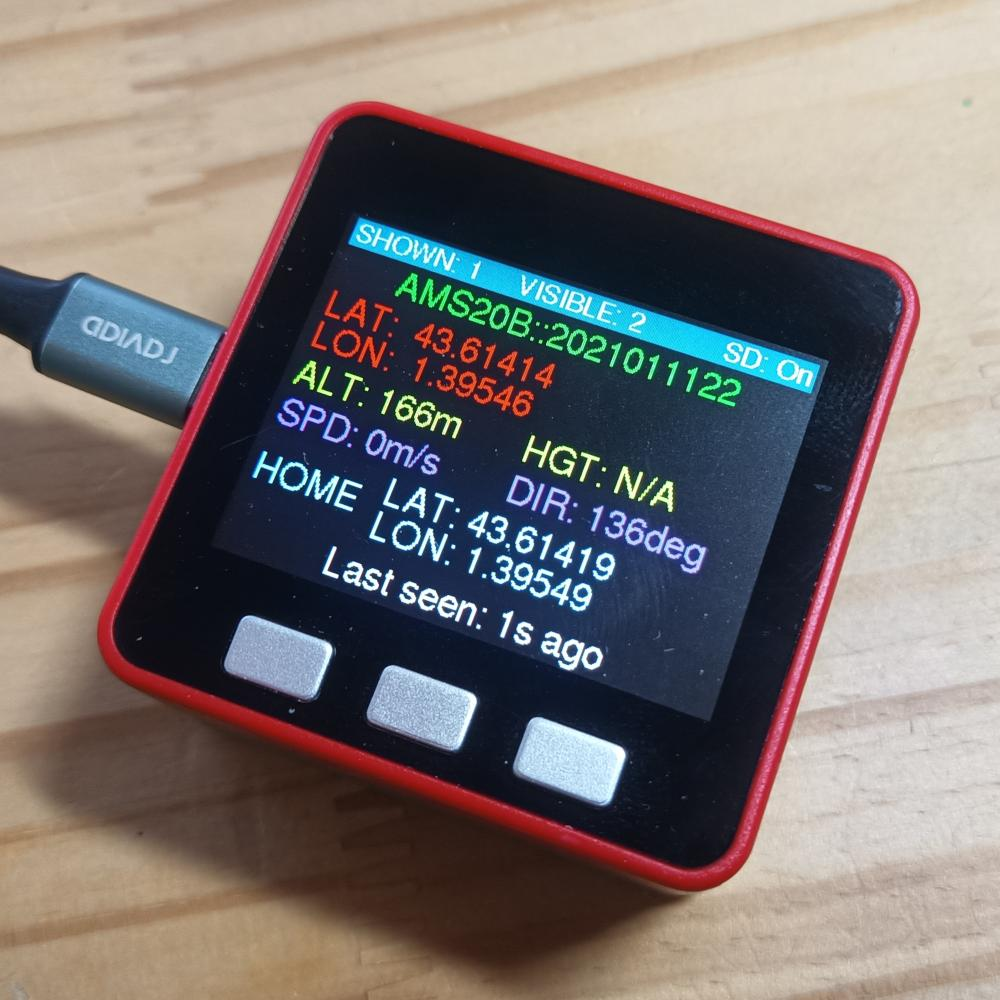

#  UAV Beacon Monitor 

UAV Beacon Monitor reads and displays transmitted eID beacons from UAV, in accordance with the
French regulation.

It is based on the work of G4lile0 on
[ESP32-WiFi-Hash-Monster](https://github.com/G4lile0/ESP32-WiFi-Hash-Monster/) from .

It is also inspired by the work of dev-fred on
[Decode_balise_ESP32](https://github.com/dev-fred/Decode_balise_ESP32).

It is designed to run on a [M5Stack
Fire](https://shop.m5stack.com/products/fire-iot-development-kit). However, it should run with
minimal changes on any devices from this family.

## How to use

Once started, the device will store and display the data of up to 50 received beacons. You can
change with the leftmost and rightmost to display another beacon.

You start the device by clicking once the red power switch. To turn off, double click the red power
switch.

All fields are currently shown, the ID (either the French version or the ANSI_CTA version), the
current location, altitude and height, speed and bearing and the takeoff location.

The age of the received data is displayed at the bottom.

A long press on the leftmost button will activate or deactivate the SDCard storage of data. A short
press on the center button will change the display brightness. A long press on the rightmost button
will erase the beacon's list.

There is a "secret" behavior on the center button long press: it will inject a new test beacon. This
will allow you to check wether the display is working properly.

## How to build

You will use the Arduino IDE to program your device.

First you need to setup your environment according to [the M5Stack
documentation](https://docs.m5stack.com/en/quick_start/m5core/arduino).

You will then need to install the library
[ESP32-Chimera-Core](https://github.com/tobozo/ESP32-Chimera-Core/) and the library
[M5Stack-SD-Updater](https://github.com/tobozo/M5Stack-SD-Updater/) using the Arduino Library
Manager.

Finally, you will be able to build this code!

## Technical aspects

Currently, this software does not roam the different WiFi channels in search for beacons. It is
locked on channel 6, which is the main channel to use given in the French regulation.

Consecutive strings of `0` are reduced to `::` (just like for IPv6) for the ID to be more readable.

There is no validation of the received data since there is currently no way to check the received
data integrity. Data shown is the data transmitted.

Finally, a small limitation, if an ANSI identification number is used in addition to the French
identification number, only the ANSI ID will be displayed (though both will be stored on the SD
card).

## Resources and documentation

- [802.11 Frame Types and Formats](https://howiwifi.com/2020/07/13/802-11-frame-types-and-formats/)
- [ESP32 Wifi API](https://docs.espressif.com/projects/esp-idf/en/latest/esp32/api-reference/network/esp_wifi.html)
- French regulation: [Arrêté du 27 décembre 2019 définissant les caractéristiques techniques des
  dispositifs de signalement électronique et lumineux des aéronefs circulant sans personne à bord](https://www.legifrance.gouv.fr/jorf/id/JORFTEXT000039685188/)
- [LGFX Fonts list](https://github.com/lovyan03/LovyanGFX/blob/master/src/lgfx/v1/lgfx_fonts.hpp#L257)
- [M5 Core API](https://docs.m5stack.com/en/api/core/system)

## Development Roadmap

- Investigate the use of
  [`esp_wifi_set_vendor_ie_cb`](https://docs.espressif.com/projects/esp-idf/en/latest/esp32/api-reference/network/esp_wifi.html#_CPPv425esp_wifi_set_vendor_ie_cb18esp_vendor_ie_cb_tPv)
  to reduce the load on the current callback

## Changelog

### Version 1.1 - 2022-03-29

- Update to the test packet
- Beacon comparison logic made more robust
- Reorganize display

### Version 1.0 - 2022-03-29

- First public release
